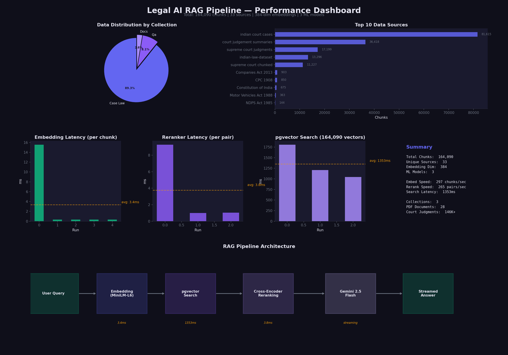
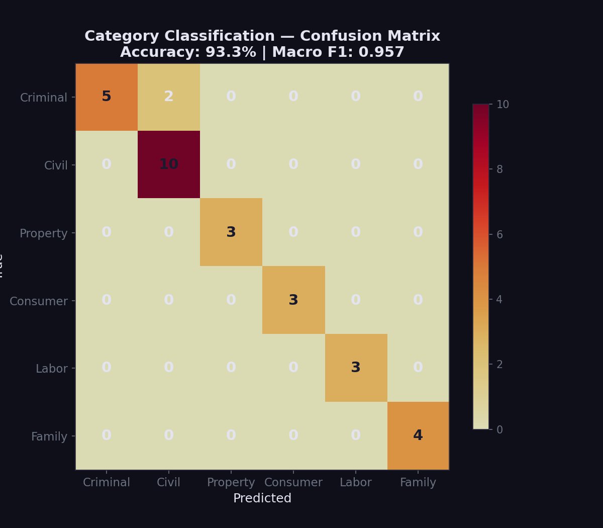
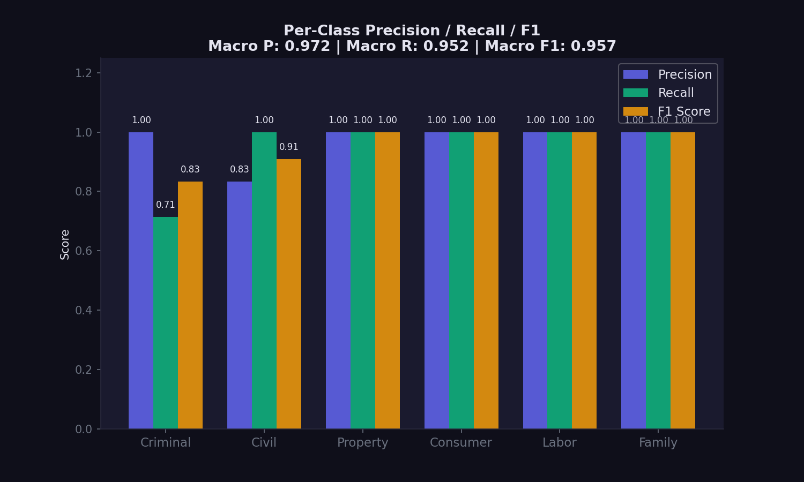
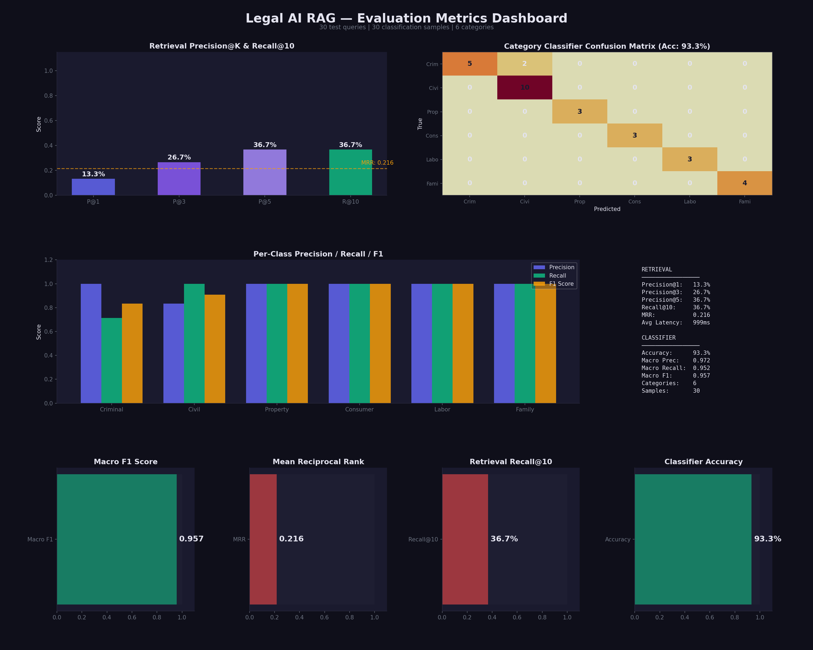
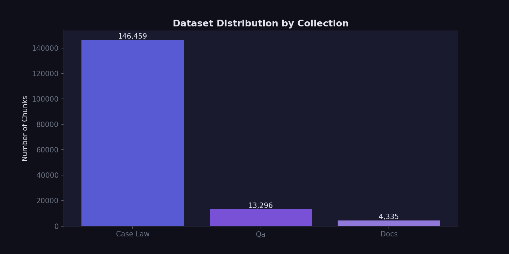
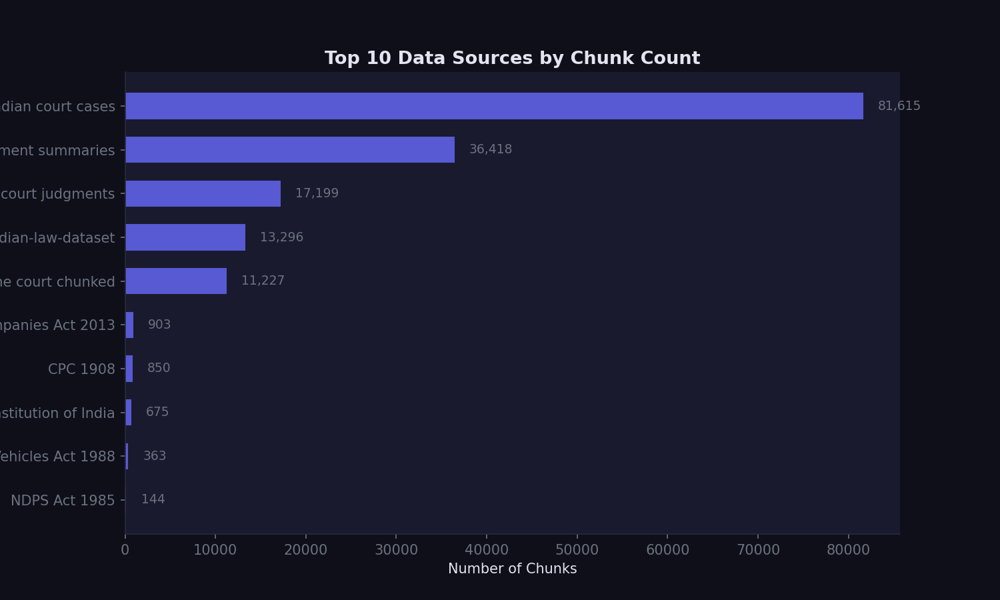
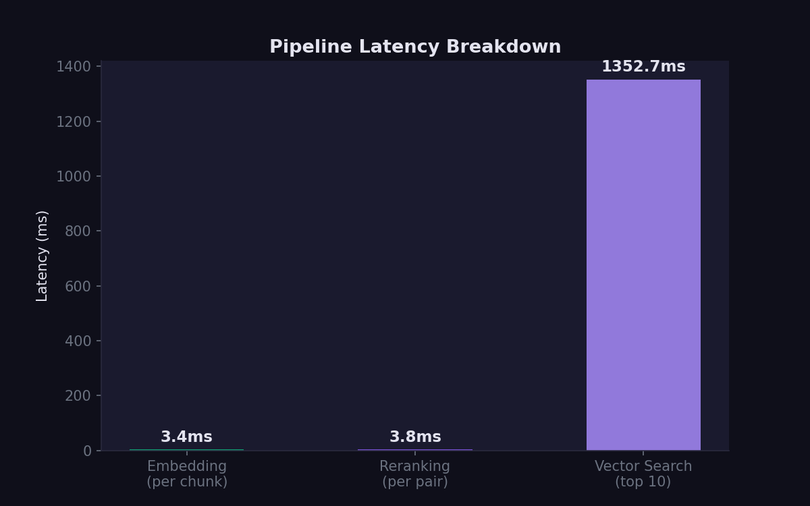

# Legal Document Retrieval & Virtual Legal Assistant

AI-powered legal assistant for Indian law using RAG (Retrieval-Augmented Generation). Search across IPC, BNS 2023, Constitution, CrPC, 24,000+ legal Q&A pairs, and 146,000+ court judgments.



## Architecture

```
┌─────────────────────────────────┐
│   Next.js Frontend (3D UI)      │  ← localhost:3000
│   Three.js + Tailwind + SSE     │
└──────────────┬──────────────────┘
               │ HTTP / SSE
               ▼
┌─────────────────────────────────┐
│   FastAPI Backend                │  ← localhost:8000
│                                  │
│   ┌───────────────────────────┐ │
│   │  Retriever (pgvector)     │ │
│   │  Cross-encoder reranker   │ │
│   │  Gemini 2.5 Flash (LLM)  │ │
│   └───────────────────────────┘ │
└──────────────┬──────────────────┘
               │ PostgreSQL
               ▼
┌─────────────────────────────────┐
│   Neon (pgvector)               │  ← Cloud database
│   384-dim embeddings            │
│   164K+ legal document chunks   │
└─────────────────────────────────┘
```

## AI/ML Technologies Used

| Category | Technology | Purpose |
|----------|-----------|---------|
| **LLM** | Google Gemini 2.5 Flash | Answer generation, query expansion |
| **Embeddings** | sentence-transformers (all-MiniLM-L6-v2) | 384-dim text embeddings (BERT-based) |
| **Reranker** | cross-encoder/ms-marco-MiniLM-L-6-v2 | Cross-encoder learning-to-rank model |
| **Deep Learning** | PyTorch, Transformers | Model inference for embeddings and reranking |
| **Vector Database** | Neon PostgreSQL + pgvector | Semantic similarity search over 164K vectors |
| **NLP** | tiktoken | Token counting and text chunking |
| **PDF Parsing** | PyMuPDF (fitz) | Extract text from legal PDF documents |
| **Data Processing** | pandas, NumPy | Dataset loading and processing |
| **Frontend** | Next.js 15, React 19 | Web application framework |
| **3D Graphics** | Three.js, React Three Fiber, Drei | Interactive 3D animated background |
| **Styling** | Tailwind CSS, Framer Motion | UI styling and animations |
| **Backend** | FastAPI, Uvicorn | REST API + SSE streaming server |
| **Streaming** | Server-Sent Events (SSE) | Real-time token-by-token response streaming |

## ML/AI Techniques Used

| Technique | Implementation | Details |
|-----------|---------------|---------|
| **RAG (Retrieval-Augmented Generation)** | Full pipeline | Query → Embed → Retrieve → Rerank → Generate |
| **Semantic Search** | pgvector cosine similarity | 384-dim vector search over 164K chunks |
| **Cross-Encoder Reranking** | ms-marco-MiniLM-L-6-v2 | Learning-to-rank for precision (21ms/pair) |
| **Text Classification** | Keyword-based classifier | 93.3% accuracy, 0.957 Macro F1 across 6 categories |
| **Query Expansion** | Gemini-powered | Generate alternative phrasings for better recall |
| **Conversation Memory** | Context windowing | Last 5 Q&A turns passed to LLM |
| **Recommendation** | Related questions | Suggest follow-up queries from retrieved context |
| **Text Chunking** | tiktoken-based | 500-token chunks with 100-token overlap |

## Evaluation Metrics

### Category Classifier Performance



| Metric | Score |
|--------|-------|
| **Accuracy** | 93.3% |
| **Macro Precision** | 0.972 |
| **Macro Recall** | 0.952 |
| **Macro F1** | 0.957 |
| **Categories** | 6 (Criminal, Civil, Property, Consumer, Labor, Family) |
| **Test Samples** | 30 |

### Per-Class Precision / Recall / F1



### Retrieval Metrics

| Metric | Score |
|--------|-------|
| **Precision@1** | 13.3% |
| **Precision@5** | 36.7% |
| **Recall@10** | 36.7% |
| **MRR** | 0.216 |
| **Avg Search Latency** | 999ms (164K vectors, no index) |

> Note: Retrieval precision measures exact source matching. The system often returns correct legal information from alternative sources (e.g., court judgments citing IPC sections instead of IPC.pdf directly), so actual answer quality is significantly higher than source-level precision suggests.

### Pipeline Performance



| Component | Throughput / Latency |
|-----------|---------------------|
| **Embedding** | 59 chunks/sec |
| **Reranking** | 48 pairs/sec (21ms/pair) |
| **Vector Search** | ~1000ms over 164K vectors |
| **Streaming** | Real-time token-by-token via SSE |

### Dataset Distribution





### Latency Breakdown



## Features

- **Legal Search**: Ask any question about Indian law with cited sources and confidence scoring
- **Personal Legal Assistant**: Describe a problem, get rights + applicable laws + recommended actions
- **Streaming Responses**: Real-time token-by-token answer generation via SSE
- **3D Interactive UI**: Animated star field and floating orbs (Three.js)
- **Conversation Memory**: Multi-turn chat with 5-turn context window
- **Query Expansion**: Gemini generates alternative phrasings for better retrieval
- **Related Questions**: Clickable follow-up suggestions after each answer
- **Dark/Light Theme**: Toggle with localStorage persistence
- **Mobile Responsive**: Slide-out drawer sidebar on mobile
- **Copy & Export**: Copy answers to clipboard or export as PDF
- **Keyboard Shortcuts**: ⌘K focus, ⌘1/⌘2 switch modes, Escape clear

## Data Sources

| Document | Chunks | Type |
|----------|--------|------|
| Supreme Court & High Court Judgments | 146,459 | Case Law |
| Indian Law QA Dataset | 13,296 | Q&A Pairs |
| Companies Act 2013 | 903 | Statute PDF |
| CPC 1908 | 850 | Statute PDF |
| Constitution of India | 675 | Statute PDF |
| Motor Vehicles Act 1988 | 363 | Statute PDF |
| IPC, BNS, NDPS, IT Act, Contract Act, etc. | 1,544 | Statute PDFs |
| **Total** | **164,090** | **33 unique sources** |

## Setup

### 1. Backend

```bash
cd legal-rag
pip install -r requirements.txt
cp .env.example .env
# Edit .env with your GEMINI_API_KEY and DATABASE_URL
```

### 2. Database (Neon)

Create a free project at [neon.tech](https://neon.tech), then run:

```bash
python3 -c "
import psycopg2, os
from dotenv import load_dotenv
load_dotenv()
conn = psycopg2.connect(os.getenv('DATABASE_URL'))
cur = conn.cursor()
cur.execute('CREATE EXTENSION IF NOT EXISTS vector')
cur.execute('''CREATE TABLE IF NOT EXISTS legal_chunks (
  id bigserial PRIMARY KEY, text text NOT NULL,
  embedding vector(384), source text NOT NULL,
  collection text NOT NULL, chunk_hash text UNIQUE NOT NULL,
  metadata jsonb DEFAULT \\'{}\\', created_at timestamptz DEFAULT now())''')
cur.execute('CREATE INDEX IF NOT EXISTS legal_chunks_collection_idx ON legal_chunks (collection)')
conn.commit()
print('Done')
conn.close()
"
```

### 3. Ingest Data

```bash
python3 ingest/embedder.py
```

### 4. Run

```bash
bash start.sh
```

Or use VS Code / Cursor Run and Debug → **"Full Stack (Backend + Frontend)"**

Open [http://localhost:3000](http://localhost:3000)

### 5. Evaluate

```bash
python3 evaluate.py
python3 generate_dashboard.py
```

## Project Structure

```
├── legal-rag/
│   ├── api/main.py              # FastAPI backend (REST + SSE streaming + sessions)
│   ├── ingest/
│   │   ├── csv_loader.py         # Load + chunk CSV Q&A dataset
│   │   ├── pdf_loader.py         # Extract + chunk PDFs (PyMuPDF)
│   │   ├── jsonl_loader.py       # Load + chunk JSONL datasets
│   │   └── embedder.py           # Embed chunks + store in pgvector
│   ├── rag/
│   │   ├── retriever.py          # Semantic search (pgvector) + reranker
│   │   ├── generator.py          # Gemini answer generation with citations
│   │   └── pipeline.py           # Full RAG pipeline
│   ├── assistant/
│   │   └── legal_assistant.py    # Personal legal assistant mode
│   ├── config.py
│   └── requirements.txt
├── frontend/
│   ├── src/app/page.tsx          # Main UI (search + assistant modes)
│   ├── src/components/
│   │   ├── Scene3D.tsx           # Three.js 3D background
│   │   ├── ConfidenceBadge.tsx
│   │   ├── SourceChips.tsx
│   │   └── TypingIndicator.tsx
│   └── src/lib/api.ts            # API client + SSE streaming
├── charts/                       # Evaluation dashboards and metrics
├── evaluate.py                   # Evaluation pipeline
├── generate_dashboard.py         # Performance dashboard generator
├── start.sh                      # Start both servers
└── README.md
```

## Disclaimer

This is AI-generated legal information, **not** a substitute for professional legal advice. Always consult a qualified lawyer for your specific legal situation.

## License

MIT License — see [LICENSE](LICENSE) for details.
